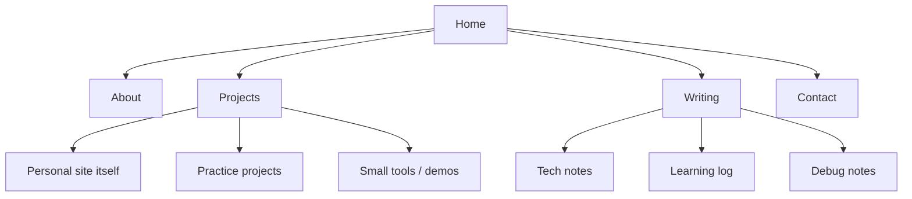
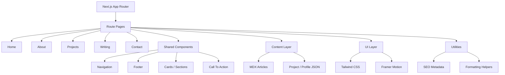

# Architecture

## 1. Project Goal

Build a developer-focused personal website that can evolve over time without relying on a CMS in the first version.

## 2. Information Architecture

## 3. Code Architecture

## 4. First-Version Rules

- No CMS in version 1.
- No lab/experiment page.
- Keep content local and componentized.
- Make the personal website itself the first project entry.

